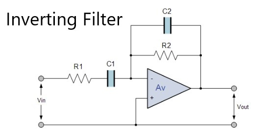

## OOP aktive Filter Projekt
### Auftrag
Sie erstellen in 2er-Gruppen eine Klasse, welche das Verhalten eines aktiven Filters (Tiefpass, Hochpass und/oder Bandpass) simuliert.
Zudem erstellen Sie ein einfaches Programm (Hauptprogramm), um die Funktion ihres Filters zu testen.

### Programm
Im Projektverzeichnis folgendes eingeben um das Programm zu starten:
```
dotnet run
```
Unser Programm enthält invertierende sowie nicht invertierende Filter der Kategorie Tiefpass, Hochpass und Bandpass. Dabei haben wir eine Oberklasse Filter.cs erstellt, welche alle gemeinsamen Daten und berechnungen enthält. Diese wird dann an alle 6 Unterklassen vererbt, welche sich nur bei den Konstruktoren, Verstärkungs- und Phasenberechnung unterscheiden.

Sobald ein Filter seine Parameter erhält (Frequenz, Widerstände und Kondensatoren), wird bei der funktion public void runBodePlot() ein Bode Diagramm simuliert. 
Der Filter wird von 20Hz bis 10MHz simuliert. Dabei werden die Verstärkung und die Phasenverschiebung im Gradmass in der Konsole angezeigt. Dazu wird noch unter /CSV im jeweiligen File des Filter ein CSV erstellt. Mit dem kann man die Simulation dann in Excel aufmachen, und z.B. einen Graph dazu erstellen.


Während der ganzen Entwicklung haben wir git als Versionsverwaltungstool verwendet. Das Projekt ist auch auf [GitHub](https://github.com/MeritonAliu/activfilter) zu finden.

Die OPV Tiefpasscharakteristik wird bei der Verstärkung berücksichtigt, bei der Phasenverschiebung jedoch nicht.

### Schemas
<p align="left">
  
  
</p>

### Benötigtee Nuget Pakete:
CsvHelper 27.2.1  

### Fussnote
- Meriton Aliu & Dario Casciato
- 29.05.2022 / BFSU Uster / HST / M.Maeder
